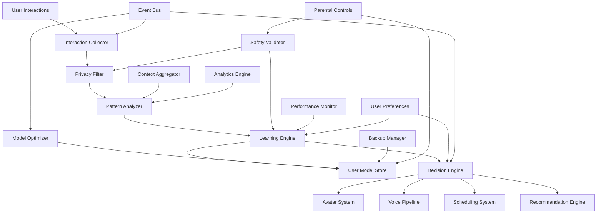

# Adaptive Learning Engine Design

## Overview

The Adaptive Learning Engine serves as the central intelligence system that powers personalized interactions across all Home Assistant components. Built around a privacy-first, on-device learning architecture, the system continuously analyzes user patterns, preferences, and behaviors to enhance conversations, scheduling decisions, recommendations, and smart home interactions while maintaining strict child safety controls and optimal performance on Jetson Nano Orin hardware.

The engine operates through a federated learning approach, where individual user models are trained locally without exposing raw interaction data. The system integrates seamlessly with existing voice, avatar, scheduling, and recommendation systems to provide increasingly personalized experiences while respecting privacy boundaries and parental controls.

## Architecture

### High-Level Architecture



### Component Architecture

The system is organized into six main layers:

1. **Collection Layer**: Interaction capture, privacy filtering, and data preprocessing
2. **Analysis Layer**: Pattern recognition, behavior modeling, and context aggregation
3. **Learning Layer**: On-device model training, optimization, and validation
4. **Decision Layer**: Real-time inference, personalization, and system integration
5. **Storage Layer**: Encrypted model persistence, backup, and recovery
6. **Safety Layer**: Content validation, parental controls, and audit logging

## Components and Interfaces

### Interaction Collector

**Purpose**: Captures user interactions across all system components while maintaining privacy and applying initial filtering.

**Key Features**:
- Multi-source interaction capture (voice, UI, scheduling, smart home)
- Real-time data anonymization and PII removal
- Interaction pattern extraction without storing raw content
- Configurable data retention policies
- Integration with existing system event buses

**Interface**:
```typescript
interface InteractionCollector {
  captureInteraction(interaction: UserInteraction): Promise<void>
  registerInteractionSource(source: InteractionSource): Promise<void>
  configureDataRetention(userId: string, policy: RetentionPolicy): Promise<void>
  getInteractionSummary(userId: string, timeRange: TimeRange): Promise<InteractionSummary>
  purgeUserData(userId: string): Promise<void>
}

interface UserInteraction {
  userId: string
  sessionId: string
  timestamp: Date
  source: InteractionSource
  type: InteractionType
  context: InteractionContext
  patterns: BehaviorPattern[]
  outcome: InteractionOutcome
  // Note: No raw content stored, only extracted patterns
}

interface InteractionContext {
  timeOfDay: TimeContext
  dayOfWeek: DayOfWeek
  location: LocationContext
  deviceType: DeviceType
  previousInteractions: PatternSummary[]
  environmentalFactors: EnvironmentalContext
}
```

### Privacy Filter

**Purpose**: Ensures all collected data meets privacy standards and removes any personally identifiable information.

**Key Features**:
- Multi-stage PII detection and removal
- Differential privacy techniques for pattern extraction
- Configurable privacy levels per user and family member
- Integration with parental control systems
- Audit logging for privacy compliance

**Interface**:
```typescript
interface PrivacyFilter {
  filterInteraction(interaction: UserInteraction): Promise<FilteredInteraction>
  validatePrivacyCompliance(data: any, userId: string): Promise<PrivacyValidationResult>
  configurePrivacyLevel(userId: string, level: PrivacyLevel): Promise<void>
  generatePrivacyReport(userId: string): Promise<PrivacyReport>
  anonymizeData(data: any): Promise<AnonymizedData>
}

interface FilteredInteraction {
  userId: string // Hashed identifier
  patterns: AnonymizedPattern[]
  context: FilteredContext
  metadata: InteractionMetadata
  privacyLevel: PrivacyLevel
}

interface PrivacyValidationResult {
  isCompliant: boolean
  violations: PrivacyViolation[]
  recommendations: PrivacyRecommendation[]
  riskLevel: RiskLevel
}
```

### Pattern Analyzer

**Purpose**: Analyzes filtered interactions to identify behavioral patterns, preferences, and learning opportunities.

**Key Features**:
- Multi-dimensional pattern recognition (temporal, contextual, behavioral)
- Preference inference from interaction patterns
- Habit detection and routine identification
- Context-aware pattern weighting
- Adaptive pattern significance scoring

**Interface**:
```typescript
interface PatternAnalyzer {
  analyzePatterns(interactions: FilteredInteraction[]): Promise<PatternAnalysisResult>
  identifyPreferences(userId: string, domain: PreferenceDomain): Promise<UserPreferences>
  detectHabits(userId: string, timeWindow: TimeWindow): Promise<HabitPattern[]>
  updatePatternWeights(userId: string, feedback: PatternFeedback): Promise<void>
  getPatternInsights(userId: string): Promise<PatternInsights>
}

interface PatternAnalysisResult {
  userId: string
  patterns: IdentifiedPattern[]
  preferences: InferredPreference[]
  habits: DetectedHabit[]
  contextualFactors: ContextualFactor[]
  confidence: ConfidenceScore
  analysisTimestamp: Date
}

interface IdentifiedPattern {
  id: string
  type: PatternType
  description: string
  frequency: number
  strength: number
  context: PatternContext
  examples: PatternExample[]
  lastObserved: Date
}
```

### Learning Engine

**Purpose**: Trains and maintains personalized user models using federated learning techniques on-device.

**Key Features**:
- On-device federated learning with privacy preservation
- Multi-modal learning (conversation, scheduling, preferences, context)
- Incremental model updates with catastrophic forgetting prevention
- Model validation and performance monitoring
- Resource-aware training with Jetson Nano Orin optimization

**Interface**:
```typescript
interface LearningEngine {
  trainUserModel(userId: string, patterns: IdentifiedPattern[]): Promise<TrainingResult>
  updateModel(userId: string, feedback: UserFeedback): Promise<ModelUpdateResult>
  validateModel(userId: string): Promise<ModelValidationResult>
  optimizeModel(userId: string, constraints: ResourceConstraints): Promise<OptimizationResult>
  resetUserModel(userId: string): Promise<void>
  getModelMetrics(userId: string): Promise<ModelMetrics>
}

interface TrainingResult {
  success: boolean
  modelVersion: string
  improvementMetrics: PerformanceMetrics
  trainingTime: number
  memoryUsage: number
  convergenceStatus: ConvergenceStatus
}

interface ModelUpdateResult {
  updated: boolean
  previousVersion: string
  newVersion: string
  performanceChange: PerformanceDelta
  rollbackAvailable: boolean
}
```

### Decision Engine

**Purpose**: Provides real-time personalized decision making and recommendations across all system components.

**Key Features**:
- Real-time inference with sub-100ms response times
- Multi-system integration (avatar, voice, scheduling, recommendations)
- Context-aware decision making with environmental factors
- Confidence-based decision validation
- Fallback to default behaviors when confidence is low

**Interface**:
```typescript
interface DecisionEngine {
  makeDecision(request: DecisionRequest): Promise<PersonalizedDecision>
  getRecommendations(context: DecisionContext): Promise<Recommendation[]>
  adaptResponse(baseResponse: string, userId: string, context: ResponseContext): Promise<string>
  predictUserIntent(partialInput: string, userId: string, context: IntentContext): Promise<IntentPrediction>
  optimizeScheduling(schedulingRequest: SchedulingRequest, userId: string): Promise<SchedulingRecommendation>
}

interface DecisionRequest {
  userId: string
  domain: DecisionDomain
  context: DecisionContext
  options: DecisionOption[]
  constraints: DecisionConstraint[]
  urgency: UrgencyLevel
}

interface PersonalizedDecision {
  selectedOption: DecisionOption
  confidence: number
  reasoning: string[]
  alternatives: AlternativeOption[]
  contextFactors: ContextFactor[]
  fallbackUsed: boolean
}
```

### User Model Store

**Purpose**: Manages encrypted storage, versioning, and backup of personalized user models.

**Key Features**:
- AES-256 encryption for all user models
- Model versioning with rollback capabilities
- Automatic backup and recovery systems
- Model compression for storage optimization
- Multi-user model isolation and access control

**Interface**:
```typescript
interface UserModelStore {
  saveUserModel(userId: string, model: UserModel): Promise<void>
  loadUserModel(userId: string): Promise<UserModel>
  createModelBackup(userId: string): Promise<BackupInfo>
  restoreFromBackup(userId: string, backupId: string): Promise<RestoreResult>
  compressModel(userId: string): Promise<CompressionResult>
  migrateUserModel(oldUserId: string, newUserId: string): Promise<MigrationResult>
  deleteUserModel(userId: string): Promise<void>
}

interface UserModel {
  userId: string
  version: string
  createdAt: Date
  lastUpdated: Date
  modelData: EncryptedModelData
  metadata: ModelMetadata
  performance: ModelPerformance
  backupInfo: BackupReference[]
}
```

### Context Aggregator

**Purpose**: Collects and synthesizes contextual information from various system components and environmental sensors.

**Key Features**:
- Multi-source context integration (time, location, device, activity)
- Real-time context updates with change detection
- Context history maintenance for pattern analysis
- Smart home sensor integration for environmental context
- Privacy-aware context filtering

**Interface**:
```typescript
interface ContextAggregator {
  getCurrentContext(userId: string): Promise<UserContext>
  updateContext(userId: string, contextUpdate: ContextUpdate): Promise<void>
  getContextHistory(userId: string, timeRange: TimeRange): Promise<ContextHistory>
  registerContextSource(source: ContextSource): Promise<void>
  predictContextChange(userId: string, timeHorizon: number): Promise<ContextPrediction>
}

interface UserContext {
  userId: string
  timestamp: Date
  temporal: TemporalContext
  spatial: SpatialContext
  device: DeviceContext
  activity: ActivityContext
  social: SocialContext
  environmental: EnvironmentalContext
  historical: HistoricalContext
}

interface TemporalContext {
  timeOfDay: TimeOfDay
  dayOfWeek: DayOfWeek
  season: Season
  isHoliday: boolean
  timeZone: string
  relativeToSchedule: ScheduleRelation
}
```

### Model Optimizer

**Purpose**: Continuously optimizes user models for performance, accuracy, and resource efficiency.

**Key Features**:
- Automated model pruning and quantization
- Performance monitoring and optimization triggers
- Resource-aware optimization for Jetson Nano Orin
- Model ensemble management for improved accuracy
- A/B testing framework for optimization validation

**Interface**:
```typescript
interface ModelOptimizer {
  optimizeModel(userId: string, optimizationGoals: OptimizationGoals): Promise<OptimizationResult>
  scheduleOptimization(userId: string, schedule: OptimizationSchedule): Promise<void>
  monitorModelPerformance(userId: string): Promise<PerformanceReport>
  pruneModel(userId: string, pruningStrategy: PruningStrategy): Promise<PruningResult>
  quantizeModel(userId: string, quantizationLevel: QuantizationLevel): Promise<QuantizationResult>
}

interface OptimizationGoals {
  targetLatency: number // milliseconds
  maxMemoryUsage: number // MB
  minAccuracy: number // percentage
  energyEfficiency: boolean
  prioritizeFeatures: string[]
}
```

## Data Models

### User Learning Profile
```typescript
interface UserLearningProfile {
  userId: string
  profileVersion: string
  createdAt: Date
  lastUpdated: Date
  
  // Behavioral Patterns
  conversationPatterns: ConversationPattern[]
  schedulingPatterns: SchedulingPattern[]
  preferencePatterns: PreferencePattern[]
  contextualPatterns: ContextualPattern[]
  
  // Learned Preferences
  communicationStyle: CommunicationStyle
  schedulingPreferences: SchedulingPreferences
  contentPreferences: ContentPreferences
  interactionPreferences: InteractionPreferences
  
  // Model Metadata
  modelPerformance: ModelPerformance
  learningProgress: LearningProgress
  privacySettings: PrivacySettings
  parentalControls: ParentalControlSettings
}

interface ConversationPattern {
  patternId: string
  type: ConversationPatternType
  frequency: number
  contexts: ConversationContext[]
  responsePreferences: ResponsePreference[]
  topicInterests: TopicInterest[]
  communicationStyle: CommunicationStyleMetrics
}

interface SchedulingPattern {
  patternId: string
  type: SchedulingPatternType
  timePreferences: TimePreference[]
  durationPatterns: DurationPattern[]
  locationPreferences: LocationPreference[]
  conflictResolutionStyle: ConflictResolutionStyle
  planningHorizon: PlanningHorizon
}
```

### Learning Feedback System
```typescript
interface LearningFeedback {
  feedbackId: string
  userId: string
  timestamp: Date
  source: FeedbackSource
  type: FeedbackType
  context: FeedbackContext
  rating: FeedbackRating
  specificFeedback: SpecificFeedback
  improvementSuggestions: string[]
}

interface SpecificFeedback {
  accuracy: AccuracyFeedback
  relevance: RelevanceFeedback
  timing: TimingFeedback
  personalization: PersonalizationFeedback
  satisfaction: SatisfactionFeedback
}

enum FeedbackType {
  POSITIVE_REINFORCEMENT = 'positive_reinforcement',
  NEGATIVE_FEEDBACK = 'negative_feedback',
  PREFERENCE_CORRECTION = 'preference_correction',
  BEHAVIOR_ADJUSTMENT = 'behavior_adjustment',
  FEATURE_REQUEST = 'feature_request'
}
```

### Personalization Context
```typescript
interface PersonalizationContext {
  userId: string
  sessionId: string
  timestamp: Date
  
  // Current State
  currentActivity: ActivityType
  deviceContext: DeviceContext
  environmentalContext: EnvironmentalContext
  socialContext: SocialContext
  
  // Historical Context
  recentInteractions: InteractionSummary[]
  behaviorTrends: BehaviorTrend[]
  preferenceEvolution: PreferenceEvolution[]
  
  // Predictive Context
  predictedNeeds: PredictedNeed[]
  anticipatedActions: AnticipatedAction[]
  contextualOpportunities: ContextualOpportunity[]
}

interface PredictedNeed {
  needType: NeedType
  confidence: number
  timeframe: TimeFrame
  context: PredictionContext
  suggestedActions: SuggestedAction[]
}
```

## Integration with Existing Systems

### Voice Pipeline Integration

The learning engine enhances voice interactions through:

- **Response Personalization**: Adapting language style, formality, and content based on learned user preferences
- **Intent Prediction**: Improving intent classification accuracy using historical interaction patterns
- **Context-Aware Processing**: Enhancing speech recognition and response generation with learned contextual preferences
- **Conversation Flow Optimization**: Personalizing conversation patterns and topic transitions

```typescript
interface VoicePipelineIntegration {
  personalizeResponse(baseResponse: string, userId: string, context: ResponseContext): Promise<string>
  enhanceIntentClassification(recognizedText: string, userId: string, context: ConversationContext): Promise<EnhancedIntent>
  adaptConversationFlow(currentFlow: ConversationFlow, userId: string): Promise<PersonalizedFlow>
  optimizeSpeechRecognition(userId: string): Promise<RecognitionOptimization>
}
```

### Avatar System Integration

The learning engine personalizes avatar behavior through:

- **Personality Adaptation**: Adjusting avatar personality traits based on user interaction preferences
- **Expression Optimization**: Learning preferred emotional expressions and timing
- **Animation Personalization**: Adapting gesture patterns and animation styles
- **Voice Characteristic Learning**: Fine-tuning voice parameters based on user feedback

```typescript
interface AvatarSystemIntegration {
  adaptAvatarPersonality(basePersonality: PersonalityTraits, userId: string): Promise<PersonalizedPersonality>
  optimizeExpressions(context: ExpressionContext, userId: string): Promise<OptimizedExpression>
  personalizeAnimations(animationType: AnimationType, userId: string): Promise<PersonalizedAnimation>
  adaptVoiceCharacteristics(baseVoice: VoiceCharacteristics, userId: string): Promise<PersonalizedVoice>
}
```

### Scheduling System Integration

The learning engine improves scheduling through:

- **Optimal Time Prediction**: Learning user's preferred times for different activities
- **Conflict Resolution**: Personalizing conflict resolution strategies based on user priorities
- **Reminder Optimization**: Adapting reminder timing and delivery methods
- **Family Coordination**: Learning family dynamics and coordination preferences

```typescript
interface SchedulingSystemIntegration {
  predictOptimalScheduling(event: CalendarEvent, userId: string): Promise<SchedulingRecommendation>
  personalizeConflictResolution(conflict: ScheduleConflict, userId: string): Promise<ResolutionStrategy>
  optimizeReminderDelivery(reminder: Reminder, userId: string): Promise<DeliveryOptimization>
  enhanceFamilyCoordination(familyEvent: FamilyEvent, familyId: string): Promise<CoordinationStrategy>
}
```

## Error Handling

### Error Categories and Strategies

1. **Learning Process Errors** (model training failures, convergence issues)
   - Automatic fallback to previous model versions
   - Incremental learning with smaller batch sizes
   - Model validation and rollback mechanisms
   - Alternative learning algorithm selection

2. **Privacy Violation Errors** (PII detection failures, consent violations)
   - Immediate data purging and model retraining
   - Enhanced privacy filtering activation
   - User notification and consent re-verification
   - Audit trail generation for compliance

3. **Performance Degradation** (memory exhaustion, inference latency)
   - Automatic model optimization and pruning
   - Resource allocation adjustment
   - Feature degradation with user notification
   - Background optimization scheduling

4. **Integration Errors** (system component failures, API timeouts)
   - Graceful degradation to default behaviors
   - Component isolation and independent operation
   - Automatic retry with exponential backoff
   - Alternative integration pathway activation

5. **Data Corruption** (model corruption, storage failures)
   - Automatic backup restoration
   - Model integrity verification and repair
   - User data recovery workflows
   - Preventive backup scheduling

### Recovery Mechanisms

```typescript
interface LearningErrorRecovery {
  handleTrainingFailure(error: TrainingError): Promise<RecoveryAction>
  handlePrivacyViolation(violation: PrivacyViolation): Promise<PrivacyRecoveryAction>
  handlePerformanceDegradation(metrics: PerformanceMetrics): Promise<OptimizationAction>
  handleIntegrationFailure(failure: IntegrationFailure): Promise<FallbackAction>
  handleDataCorruption(corruption: DataCorruption): Promise<RecoveryResult>
}
```

## Testing Strategy

### Unit Testing
- **Component Isolation**: Test each learning component independently with mocked dependencies
- **Privacy Filtering**: Comprehensive validation of PII removal and anonymization
- **Pattern Recognition**: Accuracy testing of behavioral pattern identification
- **Model Training**: Validation of learning algorithms and convergence behavior

### Integration Testing
- **End-to-End Learning**: Complete learning workflows from interaction capture to personalized decisions
- **System Integration**: Learning engine integration with voice, avatar, and scheduling systems
- **Multi-User Scenarios**: Concurrent learning and model isolation validation
- **Privacy Compliance**: Cross-component privacy enforcement and audit trail verification

### Performance Testing
- **Inference Latency**: Real-time decision making performance under various loads
- **Memory Management**: Resource usage optimization during learning and inference
- **Scalability Testing**: System performance with multiple concurrent users
- **Hardware Optimization**: Jetson Nano Orin specific performance tuning validation

### Child Safety Testing
- **Content Learning**: Validation that learning respects age-appropriate boundaries
- **Parental Controls**: Learning system integration with parental approval workflows
- **Safety Compliance**: Audit logging and safety decision verification
- **Privacy Protection**: Child-specific privacy controls and data handling validation

### Privacy and Security Testing
- **Data Anonymization**: Validation of PII removal and pattern extraction accuracy
- **Model Security**: Encryption and access control testing for user models
- **Compliance Testing**: COPPA, GDPR, and other privacy regulation compliance
- **Audit Trail**: Complete logging and reporting functionality verification