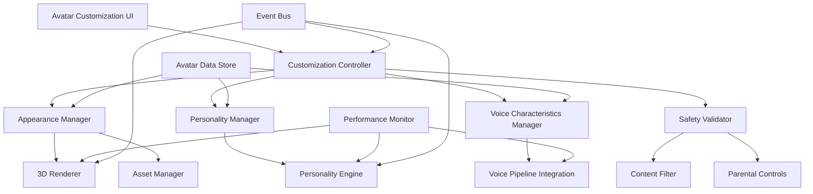

# Avatar Customization System Design

## Overview

The avatar customization system provides a comprehensive framework for personalizing AI assistant avatars through visual appearance, personality traits, voice characteristics, and emotional expressions. The system is architected as a modular, component-based design that integrates with the voice interaction pipeline while maintaining strict child safety controls and optimal performance on Jetson Nano Orin hardware.

The system separates concerns into distinct layers: appearance rendering, personality modeling, voice integration, safety validation, and data persistence, enabling independent development and testing while ensuring cohesive user experiences.

## Architecture

### High-Level Architecture



### Component Architecture

The system is organized into five main layers:

1. **Presentation Layer**: User interface components for customization and preview
2. **Control Layer**: Orchestration of customization operations and validation
3. **Processing Layer**: Core avatar rendering, personality modeling, and voice integration
4. **Safety Layer**: Content validation, parental controls, and audit logging
5. **Persistence Layer**: Encrypted data storage, backup, and recovery

## Components and Interfaces

### Avatar Customization Controller

**Purpose**: Orchestrates all avatar customization operations and coordinates between different subsystems.

**Key Features**:
- Centralized customization workflow management
- Real-time preview coordination
- User session and profile management
- Integration with safety validation and parental controls
- Performance monitoring and optimization

**Interface**:
```typescript
interface AvatarCustomizationController {
  startCustomization(userId: string): Promise<CustomizationSession>
  previewChange(change: CustomizationChange): Promise<PreviewResult>
  applyCustomization(customization: AvatarCustomization): Promise<ValidationResult>
  saveCustomization(userId: string): Promise<void>
  loadUserAvatar(userId: string): Promise<AvatarConfiguration>
  resetToDefaults(userId: string): Promise<void>
}

interface CustomizationSession {
  sessionId: string
  userId: string
  currentConfiguration: AvatarConfiguration
  pendingChanges: CustomizationChange[]
  previewActive: boolean
}
```

### Appearance Manager

**Purpose**: Manages visual avatar customization including 3D models, textures, animations, and rendering optimization.

**Key Features**:
- Modular 3D asset system (face, hair, clothing, accessories)
- Real-time rendering with performance optimization
- Age-appropriate content filtering for visual elements
- Asset caching and memory management
- Animation blending and transition systems

**Interface**:
```typescript
interface AppearanceManager {
  updateAppearance(change: AppearanceChange): Promise<RenderResult>
  previewAppearance(configuration: AppearanceConfiguration): Promise<void>
  validateAppearanceContent(configuration: AppearanceConfiguration): Promise<SafetyResult>
  getAvailableAssets(category: AssetCategory, userAge: number): Promise<AssetCollection>
  optimizeForPerformance(configuration: AppearanceConfiguration): AppearanceConfiguration
}

interface AppearanceConfiguration {
  face: FaceConfiguration
  hair: HairConfiguration
  clothing: ClothingConfiguration
  accessories: AccessoryConfiguration[]
  animations: AnimationSet
}
```

### Personality Manager

**Purpose**: Handles personality trait configuration and integration with response generation systems.

**Key Features**:
- Trait-based personality modeling
- Integration with voice pipeline response generation
- Child-appropriate personality validation
- Personality consistency enforcement
- Dynamic personality expression in interactions

**Interface**:
```typescript
interface PersonalityManager {
  updatePersonality(traits: PersonalityTraits): Promise<ValidationResult>
  validatePersonalityTraits(traits: PersonalityTraits, userAge: number): Promise<SafetyResult>
  generateResponseStyle(traits: PersonalityTraits, context: InteractionContext): ResponseStyle
  getPersonalityPresets(userAge: number): Promise<PersonalityPreset[]>
  integrateWithVoicePipeline(traits: PersonalityTraits): Promise<void>
}

interface PersonalityTraits {
  friendliness: number // 1-10 scale
  formality: number // 1-10 scale
  humor: number // 1-10 scale
  enthusiasm: number // 1-10 scale
  patience: number // 1-10 scale
  supportiveness: number // 1-10 scale
}
```

### Voice Characteristics Manager

**Purpose**: Manages voice customization and integration with the text-to-speech engine.

**Key Features**:
- Voice parameter configuration (pitch, speed, accent, tone)
- Real-time voice preview with sample text
- Integration with TTS engine from voice pipeline
- Voice characteristic validation and safety checks
- Per-user voice profile management

**Interface**:
```typescript
interface VoiceCharacteristicsManager {
  updateVoiceCharacteristics(characteristics: VoiceCharacteristics): Promise<ValidationResult>
  previewVoice(characteristics: VoiceCharacteristics, sampleText: string): Promise<AudioBuffer>
  validateVoiceSettings(characteristics: VoiceCharacteristics, userAge: number): Promise<SafetyResult>
  integrateWithTTS(characteristics: VoiceCharacteristics): Promise<void>
  getVoicePresets(userAge: number): Promise<VoicePreset[]>
}

interface VoiceCharacteristics {
  pitch: number // -2.0 to 2.0
  speed: number // 0.5 to 2.0
  accent: AccentType
  emotionalTone: EmotionalTone
  volume: number // 0.0 to 1.0
}
```

### 3D Renderer

**Purpose**: Handles real-time 3D avatar rendering with performance optimization for Jetson Nano Orin.

**Key Features**:
- Hardware-accelerated 3D rendering
- Level-of-detail (LOD) system for performance scaling
- Efficient asset streaming and caching
- Real-time lighting and shading
- Animation blending and facial expression systems

**Interface**:
```typescript
interface Avatar3DRenderer {
  renderAvatar(configuration: AvatarConfiguration): Promise<RenderFrame>
  updateAnimation(animationType: AnimationType, intensity: number): Promise<void>
  setEmotionalExpression(emotion: EmotionType, duration: number): Promise<void>
  optimizeRenderQuality(targetFPS: number): Promise<QualitySettings>
  preloadAssets(assetIds: string[]): Promise<void>
  getPerformanceMetrics(): RenderingMetrics
}

interface RenderingMetrics {
  currentFPS: number
  gpuMemoryUsage: number
  cpuUsage: number
  renderTime: number
  triangleCount: number
}
```

### Safety Validator

**Purpose**: Ensures all avatar customizations meet child safety requirements and parental approval policies.

**Key Features**:
- Multi-stage content validation for all customization types
- Age-based filtering and restriction enforcement
- Parental approval workflow management
- Audit logging for all safety decisions
- Integration with existing content safety systems

**Interface**:
```typescript
interface AvatarSafetyValidator {
  validateCustomization(customization: AvatarCustomization, userAge: number): Promise<SafetyValidationResult>
  requiresParentalApproval(customization: AvatarCustomization, userId: string): Promise<boolean>
  submitForParentalReview(customization: AvatarCustomization, userId: string): Promise<ReviewRequest>
  processParentalDecision(reviewId: string, decision: ParentalDecision): Promise<void>
  getAuditLog(userId: string, timeRange: TimeRange): Promise<SafetyAuditEntry[]>
}

interface SafetyValidationResult {
  isAllowed: boolean
  requiresApproval: boolean
  blockedElements: string[]
  riskAssessment: RiskLevel
  parentalMessage?: string
}
```

### Avatar Data Store

**Purpose**: Manages persistent storage of avatar configurations with encryption and backup capabilities.

**Key Features**:
- AES-256 encryption for all avatar data
- Atomic updates with rollback capability
- Automatic backup and recovery systems
- Data integrity verification
- Multi-user profile management

**Interface**:
```typescript
interface AvatarDataStore {
  saveAvatarConfiguration(userId: string, configuration: AvatarConfiguration): Promise<void>
  loadAvatarConfiguration(userId: string): Promise<AvatarConfiguration>
  createBackup(userId: string): Promise<BackupInfo>
  restoreFromBackup(userId: string, backupId: string): Promise<void>
  verifyDataIntegrity(userId: string): Promise<IntegrityResult>
  migrateUserData(oldUserId: string, newUserId: string): Promise<void>
}

### Character Package Manager

**Purpose**: Handles downloadable character packages including installation, validation, and management.

**Key Features**:
- Character package download and installation
- Digital signature verification for security
- Age-appropriate content validation
- Package dependency management
- Automatic updates and version control

**Interface**:
```typescript
interface CharacterPackageManager {
  installCharacterPackage(packagePath: string): Promise<InstallationResult>
  validatePackage(packagePath: string): Promise<ValidationResult>
  listAvailableCharacters(userAge: number): Promise<CharacterPackage[]>
  updateCharacterPackage(packageId: string): Promise<UpdateResult>
  uninstallCharacterPackage(packageId: string): Promise<void>
  getPackageInfo(packageId: string): Promise<CharacterPackage>
  exportUserCharacter(userId: string): Promise<CharacterPackage>
}

interface InstallationResult {
  success: boolean
  packageId: string
  installedAssets: string[]
  errors: string[]
  requiresRestart: boolean
}
```

## Data Models

### Avatar Configuration
```typescript
interface AvatarConfiguration {
  userId: string
  version: string
  appearance: AppearanceConfiguration
  personality: PersonalityTraits
  voice: VoiceCharacteristics
  emotions: EmotionalConfiguration
  createdAt: Date
  lastModified: Date
  parentallyApproved: boolean
}
```

### Customization Change
```typescript
interface CustomizationChange {
  changeId: string
  type: 'appearance' | 'personality' | 'voice' | 'emotion'
  category: string
  oldValue: any
  newValue: any
  timestamp: Date
  requiresApproval: boolean
}
```

### Asset Configuration
```typescript
interface AssetConfiguration {
  assetId: string
  category: AssetCategory
  ageRestriction: AgeRange
  performanceImpact: PerformanceLevel
  dependencies: string[]
  metadata: AssetMetadata
}

interface AssetMetadata {
  name: string
  description: string
  tags: string[]
  author: string
  safetyRating: SafetyRating
}
```

### Downloadable Character Package
```typescript
interface CharacterPackage {
  packageId: string
  version: string
  metadata: CharacterMetadata
  assets: CharacterAssets
  configuration: CharacterConfiguration
  signature: string // Digital signature for integrity
}

interface CharacterMetadata {
  name: string
  description: string
  author: string
  version: string
  ageRating: AgeRating
  tags: string[]
  thumbnail: string
  createdAt: Date
  fileSize: number
  checksum: string
}

interface CharacterAssets {
  models: ModelAsset[]
  textures: TextureAsset[]
  animations: AnimationAsset[]
  audio: AudioAsset[]
  metadata: AssetManifest
}

interface CharacterConfiguration {
  defaultAppearance: AppearanceConfiguration
  personalityPresets: PersonalityTraits[]
  voicePresets: VoiceCharacteristics[]
  emotionMappings: EmotionMapping[]
  compatibilityVersion: string
}
```

## Error Handling

### Error Categories and Strategies

1. **Rendering Errors** (GPU failures, asset loading issues)
   - Automatic quality reduction and LOD fallbacks
   - Asset cache rebuilding and alternative asset loading
   - Graceful degradation to 2D representations if needed

2. **Performance Errors** (frame rate drops, memory exhaustion)
   - Dynamic quality adjustment based on performance metrics
   - Asset unloading and memory garbage collection
   - User notification of performance limitations

3. **Safety Validation Errors** (inappropriate content detection)
   - Immediate blocking of unsafe customizations
   - Automatic reversion to safe defaults
   - Parental notification and audit logging

4. **Data Persistence Errors** (storage failures, corruption)
   - Automatic backup restoration
   - Data integrity verification and repair
   - User notification of data recovery actions

5. **Integration Errors** (voice pipeline disconnection, UI failures)
   - Component isolation and independent operation
   - Automatic reconnection attempts with exponential backoff
   - Fallback to basic functionality during integration issues

### Recovery Mechanisms

```typescript
interface AvatarErrorRecovery {
  handleRenderingError(error: RenderingError): Promise<RecoveryAction>
  handlePerformanceIssue(metrics: PerformanceMetrics): Promise<OptimizationAction>
  handleSafetyViolation(violation: SafetyViolation): Promise<SafetyAction>
  handleDataCorruption(corruption: DataCorruption): Promise<RecoveryAction>
}
```

## Testing Strategy

### Unit Testing
- **Component Isolation**: Test each customization component independently
- **Safety Validation**: Comprehensive testing of content filtering across age groups
- **Performance Testing**: Rendering performance under various hardware constraints
- **Data Persistence**: Encryption, backup, and recovery mechanism validation

### Integration Testing
- **End-to-End Customization**: Complete customization workflows from UI to persistence
- **Voice Pipeline Integration**: Avatar personality integration with response generation
- **Multi-User Scenarios**: Concurrent customization and profile switching
- **Safety Workflow**: Parental approval processes and audit trail verification

### Performance Testing
- **Rendering Benchmarks**: 60fps maintenance under various customization complexity
- **Memory Management**: GPU and CPU usage optimization validation
- **Asset Loading**: Streaming and caching performance under different scenarios
- **Hardware Optimization**: Jetson Nano Orin specific performance tuning

### Child Safety Testing
- **Content Filtering**: Automated testing of age-appropriate customization options
- **Parental Controls**: Authorization and approval workflow testing
- **Audit Compliance**: Safety decision logging and reporting verification
- **Edge Cases**: Boundary testing for safety rule enforcement

### User Experience Testing
- **Customization Flow**: Intuitive interface and preview functionality
- **Real-time Feedback**: Immediate visual and audio preview responsiveness
- **Error Communication**: Child-friendly error messages and guidance
- **Accessibility**: Support for users with different abilities and preferences
## 
Character Package File Structure

### Standard Package Format (.kac - Kiro Avatar Character)

```
character-package.kac (ZIP-based container)
├── manifest.json                 # Package metadata and configuration
├── assets/
│   ├── models/
│   │   ├── base_mesh.glb        # 3D model files
│   │   ├── face_variants/
│   │   ├── hair_styles/
│   │   └── clothing/
│   ├── textures/
│   │   ├── diffuse/             # Color textures
│   │   ├── normal/              # Normal maps
│   │   └── specular/            # Material properties
│   ├── animations/
│   │   ├── idle.fbx             # Animation files
│   │   ├── expressions/
│   │   └── gestures/
│   └── audio/
│       ├── voice_samples/       # Voice characteristic samples
│       └── sound_effects/
├── configurations/
│   ├── default_appearance.json  # Default visual configuration
│   ├── personality_presets.json # Personality trait presets
│   ├── voice_presets.json       # Voice characteristic presets
│   └── emotion_mappings.json    # Emotion-to-animation mappings
├── thumbnails/
│   ├── preview.png              # Package thumbnail
│   └── gallery/                 # Additional preview images
├── documentation/
│   ├── README.md                # Character description and usage
│   ├── LICENSE.txt              # Usage rights and restrictions
│   └── CHANGELOG.md             # Version history
└── signature.sig                # Digital signature for integrity
```

### Manifest File Structure

```json
{
  "package": {
    "id": "com.example.character.friendly-robot",
    "name": "Friendly Robot Assistant",
    "version": "1.2.0",
    "description": "A cheerful robotic assistant perfect for family interactions",
    "author": "Example Studios",
    "website": "https://example.com",
    "license": "CC-BY-SA-4.0"
  },
  "compatibility": {
    "minSystemVersion": "1.0.0",
    "maxSystemVersion": "2.0.0",
    "requiredFeatures": ["3d-rendering", "voice-synthesis"],
    "optionalFeatures": ["advanced-animations"]
  },
  "content": {
    "ageRating": "all-ages",
    "contentWarnings": [],
    "safetyLevel": "verified",
    "parentalApprovalRequired": false
  },
  "assets": {
    "totalSize": 45678901,
    "modelCount": 12,
    "textureCount": 24,
    "animationCount": 18,
    "audioCount": 6
  },
  "performance": {
    "recommendedGPUMemory": "1GB",
    "triangleCount": 15000,
    "textureResolution": "1024x1024",
    "performanceLevel": "medium"
  },
  "dependencies": [
    {
      "packageId": "com.kiro.base-animations",
      "version": ">=1.0.0"
    }
  ],
  "installation": {
    "requiresRestart": false,
    "postInstallScript": "scripts/setup.js",
    "uninstallScript": "scripts/cleanup.js"
  }
}
```

### Character Package Validation

The system validates packages through multiple stages:

1. **File Integrity**: Checksum verification and digital signature validation
2. **Content Safety**: Automated scanning for inappropriate content
3. **Age Appropriateness**: Validation against age rating and content guidelines
4. **Performance Impact**: Assessment of resource requirements and optimization
5. **Compatibility**: Version compatibility and feature requirement checking
6. **Security**: Malware scanning and sandboxed installation testing

### Package Distribution and Security

- **Digital Signatures**: All packages must be signed by verified publishers
- **Content Moderation**: Community-submitted packages undergo safety review
- **Sandboxed Installation**: Packages install in isolated environments
- **Automatic Updates**: Security patches and content updates delivered automatically
- **Parental Controls**: Parents can approve/block specific character packages
- **Audit Trail**: Complete installation and usage logging for safety compliance