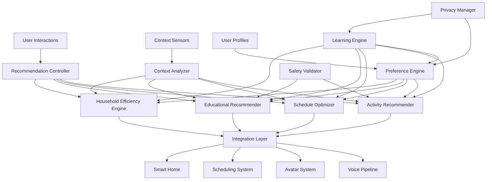

# Personalized Recommendations Engine Design

## Overview

The personalized recommendations engine is designed as an intelligent, context-aware system that learns from user behavior and preferences to provide helpful suggestions across all aspects of family life. The architecture emphasizes privacy-first local processing, real-time contextual adaptation, and seamless integration with existing home assistant features while maintaining strict child safety controls and optimal performance on Jetson Nano Orin hardware.

The system employs a hybrid approach combining collaborative filtering, content-based recommendations, and contextual bandits to deliver personalized suggestions that evolve with user preferences and family dynamics.

## Architecture

### High-Level Architecture



### Component Architecture

The system is organized into six main layers:

1. **Input Layer**: User interaction capture, context sensing, and preference collection
2. **Analysis Layer**: Context analysis, preference modeling, and behavioral pattern recognition
3. **Recommendation Layer**: Specialized recommendation engines for different domains
4. **Learning Layer**: Machine learning models for continuous improvement and adaptation
5. **Safety Layer**: Content validation, privacy protection, and parental controls
6. **Integration Layer**: Seamless coordination with other home assistant systems

## Components and Interfaces

### Recommendation Controller

**Purpose**: Orchestrates all recommendation operations and coordinates between different recommendation engines.

**Key Features**:
- Centralized recommendation request processing
- Multi-engine coordination and result aggregation
- Real-time context integration and adaptation
- User feedback collection and learning coordination
- Performance monitoring and optimization

**Interface**:
```typescript
interface RecommendationController {
  getRecommendations(userId: string, context: UserContext, type?: RecommendationType): Promise<Recommendation[]>
  submitFeedback(recommendationId: string, feedback: UserFeedback): Promise<void>
  updateUserPreferences(userId: string, preferences: UserPreferences): Promise<void>
  getRecommendationHistory(userId: string, timeRange: TimeRange): Promise<RecommendationHistory>
  refreshRecommendations(userId: string): Promise<void>
  configureRecommendationSettings(userId: string, settings: RecommendationSettings): Promise<void>
}

interface Recommendation {
  id: string
  type: RecommendationType
  title: string
  description: string
  confidence: number
  reasoning: string[]
  actionable: boolean
  integrationActions: IntegrationAction[]
  expiresAt: Date
  metadata: RecommendationMetadata
}
```

### Activity Recommender

**Purpose**: Generates personalized activity suggestions based on user interests, available time, and contextual factors.

**Key Features**:
- Interest-based activity matching and discovery
- Time-aware activity suggestions with duration consideration
- Weather and location-aware outdoor/indoor activity recommendations
- Family bonding activity prioritization
- Activity difficulty and skill level matching

**Interface**:
```typescript
interface ActivityRecommender {
  recommendActivities(userId: string, context: ActivityContext): Promise<ActivityRecommendation[]>
  discoverNewActivities(userId: string, interests: Interest[]): Promise<ActivityRecommendation[]>
  recommendFamilyActivities(familyId: string, context: FamilyContext): Promise<FamilyActivityRecommendation[]>
  updateActivityPreferences(userId: string, preferences: ActivityPreferences): Promise<void>
  trackActivityCompletion(userId: string, activityId: string, feedback: ActivityFeedback): Promise<void>
}

interface ActivityRecommendation {
  id: string
  title: string
  description: string
  category: ActivityCategory
  duration: TimeRange
  difficulty: DifficultyLevel
  requiredResources: Resource[]
  weatherDependency: WeatherRequirement
  ageAppropriate: boolean
  educationalValue: number
  physicalActivity: boolean
  socialActivity: boolean
}
```

### Schedule Optimizer

**Purpose**: Analyzes schedules and provides intelligent optimization suggestions for time management and conflict resolution.

**Key Features**:
- Schedule gap analysis and optimization suggestions
- Travel time calculation and automatic scheduling
- Conflict resolution with alternative time suggestions
- Routine optimization and habit formation recommendations
- Energy level and productivity pattern consideration

**Interface**:
```typescript
interface ScheduleOptimizer {
  optimizeSchedule(userId: string, timeRange: TimeRange): Promise<ScheduleOptimization[]>
  suggestAlternativeTimes(event: CalendarEvent, constraints: SchedulingConstraints): Promise<TimeSlot[]>
  recommendRoutineImprovements(userId: string): Promise<RoutineRecommendation[]>
  identifyScheduleConflicts(userId: string, lookahead: number): Promise<ConflictPrediction[]>
  suggestTimeBlocking(userId: string, activities: Activity[]): Promise<TimeBlockSuggestion[]>
}

interface ScheduleOptimization {
  type: OptimizationType
  description: string
  impact: ImpactAssessment
  implementation: ImplementationStep[]
  timesSaved: number
  stressReduction: number
  feasibilityScore: number
}
```

### Educational Recommender

**Purpose**: Provides age-appropriate educational content and activity recommendations for children's development.

**Key Features**:
- Developmental stage-appropriate content matching
- Learning objective alignment and progress tracking
- Multi-modal learning style accommodation
- Gamification and engagement optimization
- Parental oversight and approval integration

**Interface**:
```typescript
interface EducationalRecommender {
  recommendEducationalContent(childId: string, context: LearningContext): Promise<EducationalRecommendation[]>
  suggestLearningActivities(childId: string, subject: Subject, skillLevel: SkillLevel): Promise<LearningActivity[]>
  trackLearningProgress(childId: string, activityId: string, results: LearningResults): Promise<void>
  adaptToLearningStyle(childId: string, learningStyle: LearningStyle): Promise<void>
  requiresParentalApproval(recommendation: EducationalRecommendation): Promise<boolean>
}

interface EducationalRecommendation {
  id: string
  title: string
  description: string
  subject: Subject
  skillLevel: SkillLevel
  learningObjectives: LearningObjective[]
  estimatedDuration: number
  interactivityLevel: InteractivityLevel
  educationalValue: EducationalValue
  ageRange: AgeRange
  parentalApprovalRequired: boolean
}
```

### Household Efficiency Engine

**Purpose**: Analyzes household patterns and recommends optimizations for daily routines and task management.

**Key Features**:
- Routine analysis and efficiency identification
- Task scheduling optimization based on family patterns
- Resource management and supply tracking
- Automation opportunity identification
- Stress reduction and time-saving prioritization

**Interface**:
```typescript
interface HouseholdEfficiencyEngine {
  analyzeHouseholdPatterns(familyId: string): Promise<EfficiencyAnalysis>
  recommendTaskOptimizations(familyId: string): Promise<TaskOptimization[]>
  suggestAutomationOpportunities(familyId: string): Promise<AutomationSuggestion[]>
  optimizeSupplyManagement(familyId: string): Promise<SupplyOptimization[]>
  recommendRoutineChanges(familyId: string): Promise<RoutineChange[]>
}

interface TaskOptimization {
  taskId: string
  currentApproach: TaskApproach
  optimizedApproach: TaskApproach
  timeSavings: number
  effortReduction: number
  implementationDifficulty: DifficultyLevel
  familyImpact: FamilyImpactAssessment
}
```

### Context Analyzer

**Purpose**: Continuously analyzes user and environmental context to inform recommendation generation.

**Key Features**:
- Real-time context sensing and interpretation
- Multi-modal context fusion (location, time, weather, activity)
- Behavioral pattern recognition and prediction
- Family dynamics and interaction analysis
- Context change detection and adaptation

**Interface**:
```typescript
interface ContextAnalyzer {
  analyzeCurrentContext(userId: string): Promise<UserContext>
  predictContextChanges(userId: string, timeHorizon: number): Promise<ContextPrediction[]>
  analyzeFamilyDynamics(familyId: string): Promise<FamilyDynamics>
  detectContextualTriggers(userId: string): Promise<ContextualTrigger[]>
  updateContextModel(userId: string, contextData: ContextData): Promise<void>
}

interface UserContext {
  userId: string
  timestamp: Date
  location: LocationContext
  activity: ActivityContext
  availability: AvailabilityContext
  mood: MoodContext
  energy: EnergyLevel
  social: SocialContext
  environmental: EnvironmentalContext
  preferences: ContextualPreferences
}
```

### Learning Engine

**Purpose**: Implements machine learning algorithms for continuous improvement of recommendation quality.

**Key Features**:
- Multi-armed bandit algorithms for exploration vs. exploitation
- Collaborative filtering for family-based recommendations
- Content-based filtering for individual preferences
- Reinforcement learning from user feedback
- Privacy-preserving federated learning approaches

**Interface**:
```typescript
interface LearningEngine {
  updateUserModel(userId: string, interactions: UserInteraction[]): Promise<void>
  trainRecommendationModel(modelType: ModelType, trainingData: TrainingData): Promise<ModelMetrics>
  evaluateRecommendationQuality(recommendations: Recommendation[], feedback: UserFeedback[]): Promise<QualityMetrics>
  adaptToUserFeedback(userId: string, feedback: UserFeedback): Promise<void>
  optimizeModelPerformance(constraints: PerformanceConstraints): Promise<OptimizationResult>
}

interface ModelMetrics {
  accuracy: number
  precision: number
  recall: number
  f1Score: number
  diversityScore: number
  noveltyScore: number
  userSatisfaction: number
}
```

### Privacy Manager

**Purpose**: Ensures privacy-preserving operation and manages user data protection across all recommendation processes.

**Key Features**:
- Local data processing and model training
- Differential privacy implementation for data protection
- User consent management and preference enforcement
- Data minimization and retention policy enforcement
- Privacy-preserving analytics and reporting

**Interface**:
```typescript
interface PrivacyManager {
  enforcePrivacyPreferences(userId: string, operation: DataOperation): Promise<PrivacyDecision>
  anonymizeUserData(userData: UserData, privacyLevel: PrivacyLevel): Promise<AnonymizedData>
  auditDataUsage(userId: string, timeRange: TimeRange): Promise<DataUsageAudit>
  updatePrivacySettings(userId: string, settings: PrivacySettings): Promise<void>
  validateDataMinimization(operation: DataOperation): Promise<ValidationResult>
}

interface PrivacyDecision {
  allowed: boolean
  restrictions: DataRestriction[]
  anonymizationRequired: boolean
  consentRequired: boolean
  auditRequired: boolean
}
```

## Data Models

### User Preference Profile
```typescript
interface UserPreferences {
  userId: string
  interests: Interest[]
  activityPreferences: ActivityPreferences
  schedulePreferences: SchedulePreferences
  learningPreferences: LearningPreferences
  privacyPreferences: PrivacyPreferences
  notificationPreferences: NotificationPreferences
  lastUpdated: Date
}

interface Interest {
  category: InterestCategory
  subcategory: string
  strength: number // 0-1 scale
  recency: Date
  source: InterestSource
}
```

### Recommendation Context
```typescript
interface RecommendationContext {
  userId: string
  timestamp: Date
  requestType: RecommendationType
  currentContext: UserContext
  historicalContext: ContextHistory
  familyContext: FamilyContext
  constraints: RecommendationConstraints
  preferences: ContextualPreferences
}

interface RecommendationConstraints {
  timeAvailable: TimeRange
  locationConstraints: LocationConstraint[]
  resourceConstraints: ResourceConstraint[]
  socialConstraints: SocialConstraint[]
  budgetConstraints: BudgetConstraint
}
```

### Learning Data Structure
```typescript
interface UserInteraction {
  userId: string
  recommendationId: string
  interactionType: InteractionType
  timestamp: Date
  context: UserContext
  outcome: InteractionOutcome
  feedback: UserFeedback
  satisfaction: number
}

interface TrainingData {
  interactions: UserInteraction[]
  contextFeatures: ContextFeature[]
  outcomes: OutcomeData[]
  privacyLevel: PrivacyLevel
  dataRetentionPolicy: RetentionPolicy
}
```

## Error Handling

### Error Categories and Strategies

1. **Recommendation Generation Errors** (model failures, data unavailability)
   - Fallback to rule-based recommendations when ML models fail
   - Graceful degradation with reduced recommendation quality
   - Alternative recommendation engines for redundancy
   - User notification of limited recommendation capability

2. **Context Analysis Errors** (sensor failures, data inconsistencies)
   - Multi-source context validation and conflict resolution
   - Historical context fallback when real-time data is unavailable
   - User confirmation for uncertain context interpretations
   - Adaptive context modeling with uncertainty quantification

3. **Learning System Errors** (training failures, model corruption)
   - Model rollback to previous stable versions
   - Distributed model training with failure recovery
   - Incremental learning with checkpoint restoration
   - Performance monitoring and automatic model retraining

4. **Privacy Violation Errors** (unauthorized data access, consent violations)
   - Immediate data access termination and audit logging
   - Automatic privacy preference enforcement
   - User notification of privacy incidents
   - Data purging and consent re-validation

5. **Integration Errors** (system disconnections, API failures)
   - Standalone recommendation operation during integration failures
   - Cached integration data for offline operation
   - Alternative integration pathways and fallback mechanisms
   - User notification of reduced integration capabilities

### Recovery Mechanisms

```typescript
interface RecommendationErrorRecovery {
  handleGenerationError(error: GenerationError): Promise<FallbackRecommendations>
  handleContextError(error: ContextError): Promise<ContextRecovery>
  handleLearningError(error: LearningError): Promise<ModelRecovery>
  handlePrivacyError(error: PrivacyError): Promise<PrivacyRemediation>
  handleIntegrationError(error: IntegrationError): Promise<IntegrationFallback>
}
```

## Testing Strategy

### Unit Testing
- **Recommendation Algorithms**: Test individual recommendation engines with various user profiles
- **Context Analysis**: Validate context interpretation and pattern recognition accuracy
- **Learning Models**: Test model training, evaluation, and adaptation mechanisms
- **Privacy Protection**: Comprehensive testing of data anonymization and access controls

### Integration Testing
- **End-to-End Recommendations**: Complete recommendation workflows from context to delivery
- **System Integration**: Recommendation coordination with voice, avatar, and scheduling systems
- **Multi-User Scenarios**: Family-based recommendations and preference coordination
- **Privacy Compliance**: Cross-system privacy enforcement and audit trail verification

### Performance Testing
- **Recommendation Latency**: Response time optimization under various load conditions
- **Memory Management**: Resource usage optimization for 1.5GB memory constraint
- **Concurrent Users**: Multi-user recommendation generation performance
- **Model Training**: Learning system performance and resource utilization

### Child Safety Testing
- **Content Validation**: Age-appropriate recommendation filtering across all categories
- **Educational Quality**: Learning recommendation effectiveness and safety validation
- **Parental Controls**: Authorization and oversight mechanism testing
- **Safety Compliance**: Recommendation safety decision logging and reporting

### User Experience Testing
- **Recommendation Quality**: User satisfaction and recommendation relevance measurement
- **Contextual Accuracy**: Context interpretation and recommendation timing validation
- **Learning Effectiveness**: User preference learning and adaptation accuracy
- **Privacy Transparency**: User understanding and control of privacy settings