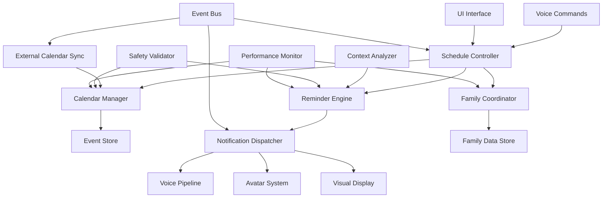

# Scheduling and Reminder System Design

## Overview

The scheduling and reminder system provides comprehensive family calendar management through an event-driven architecture that integrates with the voice interaction pipeline and avatar system. The design emphasizes intelligent, contextual reminder delivery while maintaining strict child safety controls and optimal performance on Jetson Nano Orin hardware.

The system is built around a central scheduling engine that coordinates calendar events, reminder processing, family coordination, and external integrations while providing real-time notifications through multiple channels including voice, visual displays, and avatar expressions.

## Architecture

### High-Level Architecture



### Component Architecture

The system is organized into five main layers:

1. **Interface Layer**: Voice commands, UI components, and external API integrations
2. **Control Layer**: Schedule orchestration, family coordination, and safety validation
3. **Processing Layer**: Calendar management, reminder processing, and context analysis
4. **Notification Layer**: Multi-channel notification delivery and avatar integration
5. **Storage Layer**: Encrypted data persistence, sync management, and backup systems

## Calendar Provider Integration

### Supported Calendar Services

#### Google Calendar Integration
- **Protocol**: Google Calendar API v3 with OAuth 2.0
- **Features**: Full CRUD operations, recurring events, attendee management, attachments
- **Authentication**: OAuth 2.0 with refresh token management
- **Rate Limits**: 1,000,000 queries per day, intelligent backoff implementation
- **Sync Strategy**: Incremental sync using sync tokens for efficiency

#### Microsoft Outlook Integration  
- **Protocol**: Microsoft Graph API with OAuth 2.0
- **Features**: Exchange calendar access, meeting responses, room booking
- **Authentication**: Microsoft Identity Platform with MSAL
- **Rate Limits**: Throttling-aware requests with exponential backoff
- **Sync Strategy**: Delta queries for incremental synchronization

#### Apple iCloud Integration
- **Protocol**: CalDAV over HTTPS
- **Features**: Event CRUD, recurring patterns, timezone handling
- **Authentication**: App-specific passwords or OAuth where supported
- **Sync Strategy**: CalDAV REPORT queries with VEVENT parsing
- **Limitations**: Read-only for some account types, limited attachment support

#### CalDAV Generic Support
- **Protocol**: CalDAV (RFC 4791) over HTTPS
- **Features**: Standards-compliant calendar access
- **Authentication**: Basic auth, digest auth, or OAuth
- **Providers**: Nextcloud, ownCloud, Radicale, and other CalDAV servers
- **Sync Strategy**: PROPFIND and REPORT methods for calendar discovery and sync

#### ICS Subscription Support
- **Protocol**: HTTP/HTTPS for ICS file retrieval
- **Features**: Read-only calendar subscriptions
- **Use Cases**: School calendars, public events, sports schedules
- **Refresh Strategy**: Configurable intervals from 15 minutes to 24 hours
- **Validation**: ICS format validation and content safety filtering

### Multi-Account Architecture

```typescript
interface CalendarAccount {
  id: string
  providerId: CalendarProvider
  accountName: string
  displayName: string
  email?: string
  isDefault: boolean
  calendars: CalendarInfo[]
  syncSettings: AccountSyncSettings
  authInfo: AuthenticationInfo
}

interface CalendarInfo {
  id: string
  name: string
  description?: string
  color: string
  isWritable: boolean
  isVisible: boolean
  syncEnabled: boolean
  lastSyncTime: Date
}

interface AccountSyncSettings {
  syncDirection: 'import' | 'export' | 'bidirectional'
  syncFrequency: number // minutes
  conflictResolution: 'local' | 'remote' | 'manual'
  filterRules: SyncFilter[]
}
```

### Sync Conflict Resolution

```typescript
interface SyncConflict {
  id: string
  eventId: string
  conflictType: ConflictType
  localEvent: CalendarEvent
  remoteEvent: CalendarEvent
  detectedAt: Date
  resolutionOptions: ConflictResolution[]
}

enum ConflictType {
  MODIFIED_BOTH = 'modified_both',
  DELETED_LOCAL = 'deleted_local', 
  DELETED_REMOTE = 'deleted_remote',
  DUPLICATE_EVENT = 'duplicate_event',
  TIMEZONE_MISMATCH = 'timezone_mismatch'
}

interface ConflictResolution {
  strategy: 'keep_local' | 'keep_remote' | 'merge' | 'create_both'
  mergeRules?: MergeRule[]
  userChoice?: boolean
}
```

## Components and Interfaces

### Schedule Controller

**Purpose**: Orchestrates all scheduling operations and coordinates between calendar, reminder, and family systems.

**Key Features**:
- Centralized schedule workflow management
- Integration with voice pipeline for natural language scheduling
- Real-time event and reminder coordination
- Family schedule conflict resolution
- Performance monitoring and optimization

**Interface**:
```typescript
interface ScheduleController {
  createEvent(event: CalendarEvent, userId: string): Promise<EventResult>
  updateEvent(eventId: string, changes: EventChanges, userId: string): Promise<EventResult>
  deleteEvent(eventId: string, userId: string): Promise<void>
  createReminder(reminder: Reminder, userId: string): Promise<ReminderResult>
  getSchedule(userId: string, timeRange: TimeRange): Promise<Schedule>
  coordinateFamilyEvent(event: FamilyEvent): Promise<CoordinationResult>
}

interface EventResult {
  success: boolean
  eventId: string
  conflicts: ScheduleConflict[]
  suggestedAlternatives: TimeSlot[]
}
```

### Calendar Manager

**Purpose**: Manages calendar events, recurring schedules, and event lifecycle operations.

**Key Features**:
- Comprehensive event management with CRUD operations
- Recurring event pattern processing and expansion
- Event conflict detection and resolution suggestions
- Integration with external calendar systems
- Event categorization and filtering

**Interface**:
```typescript
interface CalendarManager {
  addEvent(event: CalendarEvent): Promise<string>
  updateEvent(eventId: string, updates: Partial<CalendarEvent>): Promise<void>
  removeEvent(eventId: string): Promise<void>
  getEvents(filter: EventFilter): Promise<CalendarEvent[]>
  findConflicts(event: CalendarEvent, userId: string): Promise<ScheduleConflict[]>
  expandRecurringEvents(pattern: RecurrencePattern, range: TimeRange): Promise<CalendarEvent[]>
  suggestAlternativeTimes(event: CalendarEvent, constraints: SchedulingConstraints): Promise<TimeSlot[]>
}

interface CalendarEvent {
  id: string
  title: string
  description: string
  startTime: Date
  endTime: Date
  recurrence?: RecurrencePattern
  attendees: string[]
  location?: string
  category: EventCategory
  priority: Priority
  reminders: ReminderSettings[]
  createdBy: string
  isPrivate: boolean
}
```

### Reminder Engine

**Purpose**: Processes reminder scheduling, delivery timing, and intelligent notification strategies.

**Key Features**:
- Multi-type reminder support (time-based, location-based, context-based)
- Intelligent reminder timing based on user context and availability
- Reminder escalation and snooze management
- Integration with notification dispatcher for multi-channel delivery
- Adaptive reminder strategies based on user behavior

**Interface**:
```typescript
interface ReminderEngine {
  scheduleReminder(reminder: Reminder): Promise<string>
  cancelReminder(reminderId: string): Promise<void>
  snoozeReminder(reminderId: string, duration: number): Promise<void>
  markReminderComplete(reminderId: string): Promise<void>
  getActiveReminders(userId: string): Promise<Reminder[]>
  processReminderQueue(): Promise<ReminderProcessingResult>
  adaptReminderStrategy(userId: string, feedback: ReminderFeedback): Promise<void>
}

interface Reminder {
  id: string
  userId: string
  title: string
  description: string
  type: ReminderType
  triggerTime: Date
  recurrence?: RecurrencePattern
  priority: Priority
  deliveryMethods: NotificationMethod[]
  contextConstraints: ContextConstraint[]
  escalationRules: EscalationRule[]
  isActive: boolean
}
```

### Family Coordinator

**Purpose**: Manages family schedule coordination, shared events, and multi-user calendar interactions.

**Key Features**:
- Family calendar aggregation and conflict detection
- Shared event creation and management
- Family member availability checking
- Privacy controls for individual vs. shared events
- Family scheduling suggestions and optimization

**Interface**:
```typescript
interface FamilyCoordinator {
  createFamilyEvent(event: FamilyEvent, organizerId: string): Promise<FamilyEventResult>
  checkFamilyAvailability(timeSlot: TimeSlot, memberIds: string[]): Promise<AvailabilityResult>
  suggestFamilyMeetingTimes(duration: number, memberIds: string[], constraints: SchedulingConstraints): Promise<TimeSlot[]>
  getFamilySchedule(familyId: string, timeRange: TimeRange): Promise<FamilySchedule>
  updateMemberAvailability(userId: string, availability: AvailabilityUpdate): Promise<void>
  manageFamilyPermissions(familyId: string, permissions: FamilyPermissions): Promise<void>
}

interface FamilyEvent {
  id: string
  title: string
  description: string
  startTime: Date
  endTime: Date
  requiredAttendees: string[]
  optionalAttendees: string[]
  location?: string
  category: EventCategory
  organizerId: string
  rsvpRequired: boolean
}
```

### Context Analyzer

**Purpose**: Analyzes user context, activity, and availability to optimize reminder timing and delivery.

**Key Features**:
- Real-time user activity and availability detection
- Context-aware reminder timing optimization
- User behavior pattern learning and adaptation
- Integration with smart home sensors for location awareness
- Intelligent notification deferral and batching

**Interface**:
```typescript
interface ContextAnalyzer {
  analyzeUserContext(userId: string): Promise<UserContext>
  predictOptimalReminderTime(reminder: Reminder, context: UserContext): Promise<Date>
  shouldDeferReminder(reminder: Reminder, context: UserContext): Promise<DeferralDecision>
  batchReminders(reminders: Reminder[], context: UserContext): Promise<ReminderBatch[]>
  learnFromUserFeedback(userId: string, feedback: ContextFeedback): Promise<void>
  updateContextModel(userId: string, contextData: ContextData): Promise<void>
}

interface UserContext {
  userId: string
  currentActivity: ActivityType
  location: LocationInfo
  availability: AvailabilityStatus
  interruptibility: InterruptibilityLevel
  deviceProximity: DeviceProximity
  timeOfDay: TimeContext
  historicalPatterns: BehaviorPattern[]
}
```

### Notification Dispatcher

**Purpose**: Delivers reminders and notifications through multiple channels with personalized avatar integration.

**Key Features**:
- Multi-channel notification delivery (voice, visual, avatar)
- Personalized notification formatting based on user preferences
- Integration with avatar system for expressive reminder delivery
- Notification escalation and retry mechanisms
- Delivery confirmation and feedback collection

**Interface**:
```typescript
interface NotificationDispatcher {
  sendReminder(reminder: Reminder, context: UserContext): Promise<DeliveryResult>
  sendFamilyNotification(notification: FamilyNotification): Promise<DeliveryResult[]>
  escalateReminder(reminderId: string, escalationLevel: number): Promise<DeliveryResult>
  batchNotifications(notifications: Notification[]): Promise<BatchDeliveryResult>
  confirmDelivery(notificationId: string, feedback: DeliveryFeedback): Promise<void>
  updateDeliveryPreferences(userId: string, preferences: NotificationPreferences): Promise<void>
}

interface DeliveryResult {
  success: boolean
  deliveryMethod: NotificationMethod
  deliveryTime: Date
  userResponse?: UserResponse
  requiresEscalation: boolean
}
```

### External Calendar Sync

**Purpose**: Manages bidirectional synchronization with external calendar services and conflict resolution.

**Key Features**:
- Multi-provider calendar integration (Google Calendar, Microsoft Outlook, Apple iCloud, CalDAV)
- Multiple account support per provider for work/personal separation
- Bidirectional sync with conflict detection and resolution
- Read-only calendar subscriptions (iCal/ICS URLs)
- Offline sync queue management with automatic retry
- Data transformation and validation for external formats
- Privacy-aware selective sync capabilities
- OAuth 2.0 authentication flows for secure access
- Advanced features: attendee management, attachments, complex recurrence patterns

**Supported Calendar Providers**:
- **Google Calendar**: Full bidirectional sync with OAuth 2.0, multiple account support
- **Microsoft Outlook**: Exchange integration with modern authentication
- **Apple iCloud**: CalDAV protocol support for cross-platform compatibility
- **CalDAV Services**: Generic CalDAV support for other providers
- **ICS Subscriptions**: Read-only calendar feeds for external schedules

**Interface**:
```typescript
interface ExternalCalendarSync {
  // Connection Management
  connectCalendar(provider: CalendarProvider, credentials: CalendarCredentials, userId: string): Promise<SyncConnection>
  connectMultipleAccounts(provider: CalendarProvider, accounts: AccountCredentials[], userId: string): Promise<SyncConnection[]>
  subscribeToCalendar(icsUrl: string, refreshInterval: number, userId: string): Promise<SubscriptionConnection>
  disconnectCalendar(connectionId: string): Promise<void>
  
  // Sync Operations
  syncCalendar(connectionId: string): Promise<SyncResult>
  syncAllCalendars(userId: string): Promise<SyncResult[]>
  forceSyncCalendar(connectionId: string): Promise<SyncResult>
  
  // Conflict Resolution
  resolveConflict(conflict: SyncConflict, resolution: ConflictResolution): Promise<void>
  getConflicts(connectionId: string): Promise<SyncConflict[]>
  
  // Status and Configuration
  getSyncStatus(connectionId: string): Promise<SyncStatus>
  configureSyncSettings(connectionId: string, settings: SyncSettings): Promise<void>
  updateRefreshInterval(subscriptionId: string, interval: number): Promise<void>
  
  // Advanced Features
  syncAttendeeResponses(eventId: string, connectionId: string): Promise<AttendeeSync>
  handleCalendarInvitation(invitation: CalendarInvitation, response: InvitationResponse): Promise<void>
  syncEventAttachments(eventId: string, connectionId: string): Promise<AttachmentSync>
}

interface SyncConnection {
  id: string
  provider: CalendarProvider
  accountId: string
  accountName: string
  isActive: boolean
  lastSyncTime: Date
  syncSettings: SyncSettings
  authStatus: AuthenticationStatus
}

interface SyncResult {
  success: boolean
  connectionId: string
  eventsImported: number
  eventsExported: number
  eventsUpdated: number
  eventsDeleted: number
  conflicts: SyncConflict[]
  errors: SyncError[]
  lastSyncTime: Date
  nextSyncTime: Date
}

interface SyncSettings {
  bidirectionalSync: boolean
  syncCalendars: string[] // Specific calendar IDs to sync
  excludeCalendars: string[] // Calendar IDs to exclude
  syncAttendees: boolean
  syncAttachments: boolean
  maxAttachmentSize: number // in MB
  syncPrivateEvents: boolean
  conflictResolution: ConflictResolutionStrategy
}
```

## Data Models

### Calendar Event Data Structure
```typescript
interface CalendarEvent {
  id: string
  title: string
  description: string
  startTime: Date
  endTime: Date
  allDay: boolean
  recurrence?: RecurrencePattern
  location?: LocationInfo
  attendees: Attendee[]
  category: EventCategory
  priority: Priority
  visibility: VisibilityLevel
  reminders: ReminderSettings[]
  metadata: EventMetadata
  createdAt: Date
  updatedAt: Date
  createdBy: string
}

interface RecurrencePattern {
  frequency: RecurrenceFrequency
  interval: number
  daysOfWeek?: DayOfWeek[]
  dayOfMonth?: number
  monthOfYear?: number
  endDate?: Date
  occurrenceCount?: number
  exceptions: Date[]
}
```

### Reminder Configuration
```typescript
interface Reminder {
  id: string
  userId: string
  eventId?: string
  title: string
  description: string
  type: ReminderType
  triggerTime: Date
  recurrence?: RecurrencePattern
  priority: Priority
  deliveryMethods: NotificationMethod[]
  contextConstraints: ContextConstraint[]
  escalationRules: EscalationRule[]
  completionStatus: CompletionStatus
  snoozeHistory: SnoozeRecord[]
  userFeedback: ReminderFeedback[]
}

interface EscalationRule {
  delayMinutes: number
  escalationMethod: NotificationMethod
  maxEscalations: number
  escalationMessage?: string
}
```

### Family Schedule Structure
```typescript
interface FamilySchedule {
  familyId: string
  members: FamilyMember[]
  sharedEvents: CalendarEvent[]
  conflictResolutions: ConflictResolution[]
  permissions: FamilyPermissions
  preferences: FamilyPreferences
}

interface FamilyMember {
  userId: string
  role: FamilyRole
  permissions: MemberPermissions
  visibility: VisibilitySettings
  availability: AvailabilitySchedule
}
```

### Calendar Provider Data Models

```typescript
interface CalendarProvider {
  id: string
  name: string
  type: ProviderType
  apiEndpoint: string
  authType: AuthenticationType
  capabilities: ProviderCapabilities
  rateLimits: RateLimit[]
}

enum ProviderType {
  GOOGLE_CALENDAR = 'google_calendar',
  MICROSOFT_OUTLOOK = 'microsoft_outlook', 
  APPLE_ICLOUD = 'apple_icloud',
  CALDAV = 'caldav',
  ICS_SUBSCRIPTION = 'ics_subscription'
}

interface ProviderCapabilities {
  bidirectionalSync: boolean
  attendeeManagement: boolean
  attachmentSupport: boolean
  recurringEvents: boolean
  timezoneSupport: boolean
  categorySupport: boolean
  colorSupport: boolean
  maxAttachmentSize: number // in MB
  supportedRecurrencePatterns: RecurrenceType[]
}

interface ExternalEventMapping {
  localEventId: string
  externalEventId: string
  providerId: string
  accountId: string
  calendarId: string
  lastSyncTime: Date
  syncHash: string
  conflictStatus: ConflictStatus
}

interface SyncMetadata {
  syncToken?: string // For incremental sync
  etag?: string // For change detection
  lastModified: Date
  syncVersion: number
  providerSpecificData: Record<string, any>
}
```

## Error Handling

### Error Categories and Strategies

1. **Calendar Sync Errors** (external service failures, network issues)
   - Automatic retry with exponential backoff
   - Offline queue management for pending changes
   - Conflict resolution workflows for sync discrepancies
   - User notification of sync status and issues

2. **Reminder Delivery Errors** (notification failures, device unavailability)
   - Multi-channel fallback delivery mechanisms
   - Escalation to alternative notification methods
   - Persistent retry with intelligent timing
   - Manual delivery confirmation options

3. **Family Coordination Errors** (permission conflicts, scheduling conflicts)
   - Automatic conflict detection and resolution suggestions
   - Fallback to individual scheduling when family coordination fails
   - Permission validation and error messaging
   - Alternative scheduling recommendations

4. **Performance Errors** (memory constraints, processing delays)
   - Intelligent reminder queue management and prioritization
   - Background processing optimization
   - Resource usage monitoring and adaptive scaling
   - Graceful degradation of non-essential features

5. **Data Integrity Errors** (corruption, validation failures)
   - Automatic data validation and repair
   - Backup restoration for corrupted schedules
   - Event consistency checking and correction
   - User notification of data recovery actions

### Recovery Mechanisms

```typescript
interface ScheduleErrorRecovery {
  handleSyncError(error: SyncError): Promise<RecoveryAction>
  handleReminderFailure(failure: ReminderFailure): Promise<DeliveryAlternative>
  handleFamilyConflict(conflict: FamilyConflict): Promise<ConflictResolution>
  handlePerformanceIssue(issue: PerformanceIssue): Promise<OptimizationAction>
  handleDataCorruption(corruption: DataCorruption): Promise<RecoveryResult>
}
```

## Testing Strategy

### Unit Testing
- **Component Isolation**: Test each scheduling component independently
- **Event Management**: Comprehensive testing of CRUD operations and recurring events
- **Reminder Processing**: Validation of reminder timing, delivery, and escalation
- **Family Coordination**: Multi-user scheduling and conflict resolution testing

### Integration Testing
- **End-to-End Scheduling**: Complete scheduling workflows from creation to reminder delivery
- **External Calendar Sync**: Bidirectional sync testing with multiple calendar providers
- **Voice Pipeline Integration**: Natural language scheduling command processing
- **Avatar System Integration**: Reminder delivery through avatar expressions and voice

### Performance Testing
- **Scalability Testing**: System performance with large numbers of events and reminders
- **Memory Management**: Resource usage optimization under various load conditions
- **Real-time Processing**: Reminder delivery timing accuracy and system responsiveness
- **Concurrent User Testing**: Multi-user family scheduling performance validation

### Child Safety Testing
- **Content Validation**: Age-appropriate event and reminder content filtering
- **Parental Controls**: Authorization and approval workflow testing
- **Privacy Protection**: Family schedule visibility and access control validation
- **Safety Compliance**: Audit trail and safety decision logging verification

### User Experience Testing
- **Natural Language Processing**: Voice command interpretation and scheduling accuracy
- **Notification Effectiveness**: Reminder delivery timing and user response optimization
- **Family Coordination**: Shared scheduling usability and conflict resolution
- **Accessibility**: Support for users with different abilities and preferences