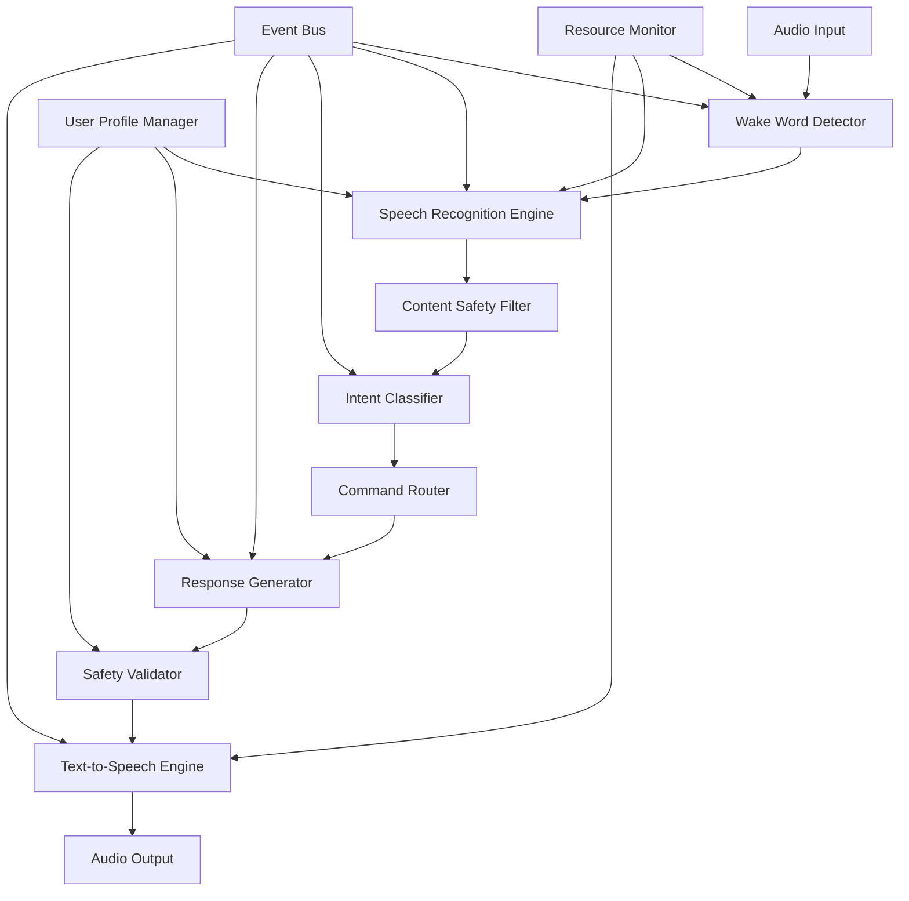

# Voice Interaction Pipeline Design

## Overview

The voice interaction pipeline is designed as a modular, event-driven system that processes voice input through a series of specialized components. The architecture prioritizes low latency, offline operation, and child safety while maintaining efficient resource usage on Jetson Nano Orin hardware.

The pipeline follows a unidirectional data flow: Audio Input → Wake Word Detection → Speech Recognition → Intent Processing → Response Generation → Text-to-Speech → Audio Output, with safety validation at multiple stages.

## Architecture

### High-Level Architecture



### Component Architecture

The system is organized into four main layers:

1. **Hardware Abstraction Layer**: Manages audio I/O, hardware-specific optimizations
2. **Processing Layer**: Core voice processing components (wake word, ASR, TTS)
3. **Intelligence Layer**: Intent classification, response generation, safety validation
4. **Integration Layer**: Command routing, user profile management, event coordination

## Components and Interfaces

### Wake Word Detection Service

**Purpose**: Continuously monitors audio input for activation phrases while minimizing resource usage.

**Key Features**:
- Offline neural network model optimized for Jetson Nano Orin
- Configurable sensitivity and multiple wake word support
- Power-efficient always-on operation
- False positive reduction through temporal validation

**Interface**:
```typescript
interface WakeWordDetector {
  startListening(): Promise<void>
  stopListening(): Promise<void>
  onWakeWordDetected(callback: (confidence: number, timestamp: number) => void): void
  updateSensitivity(level: number): void
  addWakeWord(phrase: string, modelPath: string): Promise<void>
}
```

### Speech Recognition Engine

**Purpose**: Converts spoken audio to text with support for multiple users and languages.

**Key Features**:
- Offline ASR using optimized models (Whisper.cpp or similar)
- Per-user language and accent adaptation
- Real-time processing with streaming recognition
- Noise reduction and audio preprocessing
- Confidence scoring and uncertainty handling

**Interface**:
```typescript
interface SpeechRecognizer {
  recognize(audioStream: AudioStream, userId?: string): Promise<RecognitionResult>
  startStreaming(userId?: string): StreamingRecognition
  updateUserProfile(userId: string, profile: VoiceProfile): void
  setLanguage(language: string): void
}

interface RecognitionResult {
  text: string
  confidence: number
  alternatives: string[]
  processingTime: number
}
```

### Content Safety Filter

**Purpose**: Validates all voice input and generated responses for child-appropriate content.

**Key Features**:
- Multi-stage filtering (profanity, inappropriate topics, harmful instructions)
- Age-based filtering rules
- Context-aware safety assessment
- Parental override capabilities
- Audit logging for review

**Interface**:
```typescript
interface ContentSafetyFilter {
  validateInput(text: string, userId: string): Promise<SafetyResult>
  validateOutput(text: string, userId: string): Promise<SafetyResult>
  updateFilterRules(rules: SafetyRules): void
  getAuditLog(timeRange: TimeRange): Promise<SafetyAuditEntry[]>
}

interface SafetyResult {
  isAllowed: boolean
  riskLevel: 'low' | 'medium' | 'high'
  blockedReasons: string[]
  sanitizedText?: string
}
```

### Intent Classification Service

**Purpose**: Analyzes recognized speech to determine user intent and extract relevant parameters.

**Key Features**:
- Local NLU model for offline operation
- Context-aware intent recognition
- Multi-turn conversation support
- Confidence-based disambiguation
- Extensible intent registry

**Interface**:
```typescript
interface IntentClassifier {
  classifyIntent(text: string, context: ConversationContext): Promise<IntentResult>
  registerIntent(intent: IntentDefinition): void
  updateContext(context: ConversationContext): void
}

interface IntentResult {
  intent: string
  confidence: number
  parameters: Record<string, any>
  requiresConfirmation: boolean
}
```

### Command Router

**Purpose**: Routes classified intents to appropriate system modules and manages command execution.

**Key Features**:
- Plugin-based routing system
- Command validation and authorization
- Execution monitoring and timeout handling
- Result aggregation and error handling
- Integration with smart home, scheduling, and other modules

**Interface**:
```typescript
interface CommandRouter {
  routeCommand(intent: IntentResult, userId: string): Promise<CommandResult>
  registerHandler(intent: string, handler: CommandHandler): void
  executeCommand(command: Command): Promise<CommandResult>
}

interface CommandResult {
  success: boolean
  response: string
  data?: any
  executionTime: number
}
```

### Response Generation Service

**Purpose**: Creates natural, contextually appropriate responses based on command results and user profiles.

**Key Features**:
- Template-based response generation
- Personality-aware language adaptation
- Context and conversation history integration
- Multi-modal response support (text + visual cues)
- Response variation to avoid repetition

**Interface**:
```typescript
interface ResponseGenerator {
  generateResponse(result: CommandResult, context: ResponseContext): Promise<string>
  setPersonality(personality: PersonalityProfile): void
  addResponseTemplate(intent: string, template: ResponseTemplate): void
}

interface ResponseContext {
  userId: string
  conversationHistory: ConversationTurn[]
  currentIntent: string
  userPreferences: UserPreferences
}
```

### Text-to-Speech Engine

**Purpose**: Converts generated text responses to natural-sounding speech output.

**Key Features**:
- Offline TTS with multiple voice options
- SSML support for speech control
- Voice characteristic consistency per avatar
- Streaming audio generation for low latency
- Emotional tone and emphasis control

**Interface**:
```typescript
interface TextToSpeechEngine {
  synthesize(text: string, options: TTSOptions): Promise<AudioBuffer>
  startStreaming(text: string, options: TTSOptions): AudioStream
  setVoice(voiceId: string): void
  updateSpeechRate(rate: number): void
}

interface TTSOptions {
  voiceId: string
  rate: number
  pitch: number
  volume: number
  emotion?: 'neutral' | 'happy' | 'concerned' | 'excited'
}
```

## Data Models

### User Voice Profile
```typescript
interface VoiceProfile {
  userId: string
  preferredLanguage: string
  accentAdaptation: AccentModel
  speechPatterns: SpeechPattern[]
  safetyLevel: 'child' | 'teen' | 'adult'
  lastUpdated: Date
}
```

### Conversation Context
```typescript
interface ConversationContext {
  sessionId: string
  userId: string
  startTime: Date
  turns: ConversationTurn[]
  activeTopics: string[]
  pendingActions: PendingAction[]
}

interface ConversationTurn {
  timestamp: Date
  userInput: string
  recognizedText: string
  intent: IntentResult
  response: string
  executionResult: CommandResult
}
```

### Audio Processing Configuration
```typescript
interface AudioConfig {
  sampleRate: number
  channels: number
  bitDepth: number
  bufferSize: number
  noiseReduction: boolean
  echoCancellation: boolean
  automaticGainControl: boolean
}
```

## Error Handling

### Error Categories and Strategies

1. **Hardware Errors** (microphone failure, audio device issues)
   - Automatic device detection and fallback
   - Visual error indicators for users
   - Graceful degradation to text-based interaction

2. **Processing Errors** (model loading failures, memory issues)
   - Circuit breaker pattern for failing components
   - Automatic model reloading with exponential backoff
   - Resource monitoring and adaptive quality reduction

3. **Network Errors** (for cloud-enhanced features)
   - Offline-first design with local fallbacks
   - Transparent degradation of cloud-dependent features
   - Automatic retry with jitter for transient failures

4. **Safety Validation Errors**
   - Fail-safe approach: block questionable content by default
   - Detailed logging for parental review
   - Alternative response generation for blocked content

5. **User Interaction Errors** (unclear speech, ambient noise)
   - Confidence-based clarification requests
   - Context-aware disambiguation
   - Progressive assistance (simple → detailed explanations)

### Error Recovery Mechanisms

```typescript
interface ErrorRecoveryManager {
  handleError(error: VoicePipelineError): Promise<RecoveryAction>
  registerRecoveryStrategy(errorType: string, strategy: RecoveryStrategy): void
  getSystemHealth(): SystemHealthStatus
}

interface RecoveryAction {
  action: 'retry' | 'fallback' | 'degrade' | 'notify'
  parameters: Record<string, any>
  userMessage?: string
}
```

## Testing Strategy

### Unit Testing
- **Component Isolation**: Test each pipeline component independently with mocked dependencies
- **Audio Processing**: Validate wake word detection, speech recognition accuracy with test audio samples
- **Safety Filtering**: Comprehensive test cases for content validation across age groups
- **Performance Testing**: Memory usage, CPU utilization, and latency measurements under load

### Integration Testing
- **End-to-End Pipeline**: Complete voice interaction flows from wake word to response
- **Multi-User Scenarios**: Concurrent users, profile switching, conversation context management
- **Error Scenarios**: Network failures, hardware issues, resource constraints
- **Safety Validation**: Cross-component safety enforcement and audit trail verification

### Performance Testing
- **Latency Benchmarks**: Voice response times under various system loads
- **Resource Monitoring**: Memory and CPU usage patterns during extended operation
- **Stress Testing**: System behavior under high concurrent usage
- **Hardware Optimization**: Jetson Nano Orin specific performance tuning validation

### Child Safety Testing
- **Content Filtering**: Automated testing of safety rules across diverse input scenarios
- **Age Appropriateness**: Response validation for different user age groups
- **Parental Controls**: Authorization and override mechanism testing
- **Audit Compliance**: Logging and reporting functionality verification

### Offline Operation Testing
- **Network Isolation**: Complete functionality testing without internet connectivity
- **Graceful Degradation**: Feature availability and user communication during offline mode
- **Recovery Testing**: Automatic restoration of cloud features when connectivity returns
- **Local Model Performance**: Accuracy and speed of offline AI models